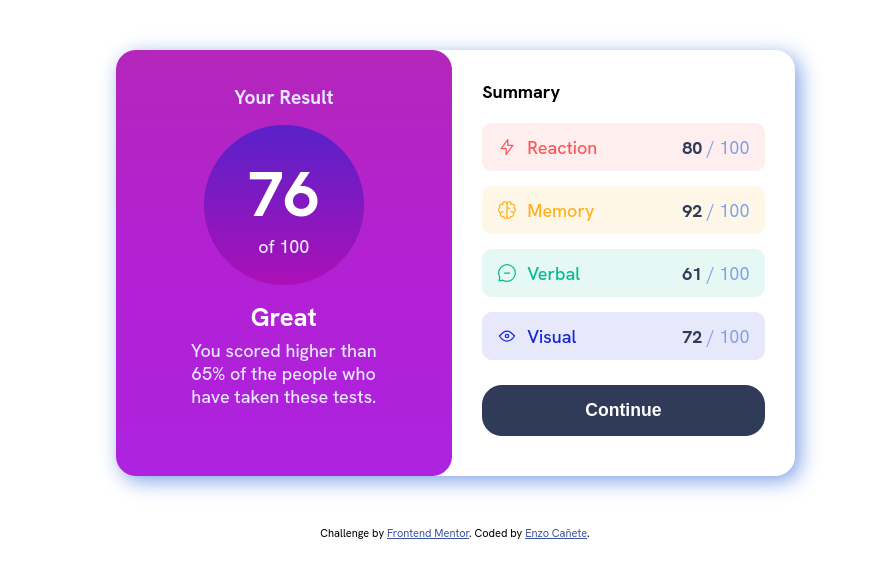

# Frontend Mentor - Results summary component solution

This is a solution to the [Results summary component challenge on Frontend Mentor](https://www.frontendmentor.io/challenges/results-summary-component-CE_K6s0maV). Frontend Mentor challenges help you improve your coding skills by building realistic projects. 

## Table of contents
[Overview](#overview)
  - [The challenge](#the-challenge)
  - [Screenshot](#screenshot)
  - [Links](#links)
- [My process](#my-process)
  - [Built with](#built-with)
  - [What I learned](#what-i-learned)
  - [Continued development](#continued-development)
  - [Useful resources](#useful-resources)
- [Author](#author)
- [Acknowledgments](#acknowledgments)

## Overview

### The challenge

Users should be able to:

- View the optimal layout for the interface depending on their device's screen size
- See hover and focus states for all interactive elements on the page
- **Bonus**: Use the local JSON data to dynamically populate the content

### Screenshot

### Links

- Solution URL: https://github.com/enzo0989/frontend-challenge01
- Live Site URL: https://enzo0989.github.io/frontend-challenge01/

## My process

So, this is the first project that i do on my own and i i took the next steps to make it:
1) first, i looked at the designs to decide how would i write the structure, how many div's i would need and what classes could i create to reuse some styles later.
2) once i was satisfied with my ideas i started to write the HTML.
3) once that was done i started to write the CSS, first a simple reset for the styles that come with the browser and variables for the colors.
4) and finally, i wrote all the styles for the different elements of the page.   

I may have wrote it like it was a really linear process but in reality it was more like jumping between different steps to edit or add something that i haven't though in the first time that i did that part, then, go back to the part that i was working in the first place, find something else that i wanted to change, change it and repeat this process till i finished all.  
### Built with

- basic HTML
- vanilla CSS variables
- flexbox

### What I learned

In this challenge in particular i learned how do hsl and hsla work, i used to only use colors with rgb or rgba but this time i wanted to expand a little bit and learned how do hsl works. It ain't much but i'm happy about it. Also, i learned how to make animations which it's great, in the past i used to look at animations and think that they were something difficult to make but they weren't that hard, at least at this point in my development.

### Continued development

I would love to learn how to use javaScript in the future, i think that would add a nice touch to a component like this and also CSS Grid, i have the feeling that something could have been made more easily with that tool. 

### Useful resources

- [resource 1](https://www.example.com) - This help me to understand how to make animations.

## Author

- Frontend Mentor - [@enzo0989](https://www.frontendmentor.io/profile/enzo0989)
- instagram - [@stoic.mind](https://www.instagram.com/st0ic_mind/)

If someone is reading this, Thank you for taking the time! sorry if something is wrote incorrectly, i'm learning english at the same time that i learn web development and my brain hurts :P
I would really appreciate some feedback whether is about the CSS or the HTML. 